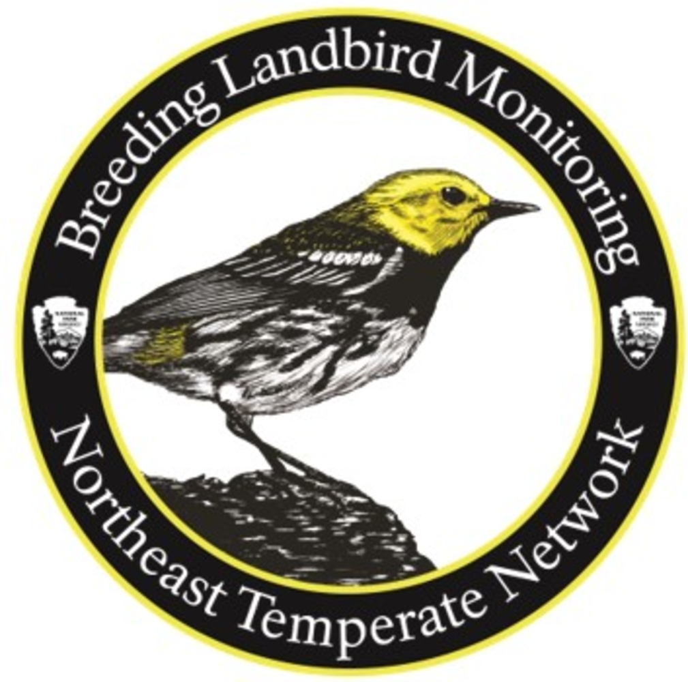

      
```{r setup, include=FALSE, eval = F}
knitr::opts_chunk$set(echo = FALSE, eval = FALSE)
# load in packages
library(magrittr)
library(devtools)
library(tidyverse)
library(NCRNbirds)
library(leaflet)
library(cowplot)
library(readxl)
library(lubridate)
library(plotly)
library(knitr)
library(kableExtra)
library(formattable)
library(RColorBrewer)
```


`getParkNames(BirdData[ParkList == params$Park], name.class = "long")`{.tabset .tabset-fade .tabset-pills}
------------------------------------
## {.tabset}
### Overview
<div style="float:right;position:relative;top:10px;padding:5px 5px 5px 10px;margin:0px 5px 10px 5px">
```{r Effmap, echo = FALSE,  fig.height=5.75, fig.width= 5.75, fig.align = 'left', warning= FALSE, comment=FALSE, message=FALSE,}

```
<p class='capwrap'>
Map of monitoring effort (# surveys) at `params$Park`'s permanent sites between `params$minYear` and `params$maxYear`. Clicking on the site displays the total number of surveys since `params$minYear`. </p>
</div>

<h3> Long-term forest bird monitoring program </h3>

<p> The Northeast Temperate Network's (NETN) breeding bird monitoring program has been implemented since 2006 in partnership with the <a href="https://vtecostudies.org/">Vermont Center of Ecostudies</a> and many volunteer birders. The program was established to determine status and trends in species diversity and the abundance of breeding landbirds in the park. </p>

<p>This report summarizes forest bird monitoring results between `params$minYear` and `params$maxYear` in `getParkNames(BirdData[ParkList == params$Park], name.class = "long")` (`params$Park`) for the following topics:</p>
<ul>
 <li> <b>Bird Diversity:</b> A summary of the number of species detected since `params$minYear` across all monitoring sites.</li> 
 <li> <b>Bird Community Index:</b> A summary of the condition of the park's forest bird community.</li> 
 <li> <b>Species Trends:</b> A summary of bird abundance over time for the most common species. </li> 
 <li> <b>Conclusions</b>: A summary of bird monitoring results in the context of park forest health. </li>
 <li> <b>Supporting Resources:</b> List of references and associated documentation for the bird monitoring program.</li> 
 </ul>

<br>
<h3>Methods</h3>

<p> The analyses in this report are based on repeated visits to  permanent monitoring sites shown in the map to the right. Each point is typically visited once a year but occasionally twice during the peak breading season from late spring to mid summer. At each visit all birds heard or seen during a 10-minute period are recorded. Additionally, the observers indicate an approximate distance to the bird. For detailed information on the methods and analysis, please consult the Supporting Resources. </p>

<p> If you have questions about this program, report, or would like to acquire data or speak about bird monitoring in your park please contact NETN staff  <a href="mailto:ed_sharron@nps.gov"> Ed Sharron (Bird Volunteer Coordinator)</a>,  <a href="mailto:adam_kozlowksi@nps.gov"> Adam Kozlowski (Data Manager)</a>, or <a href="mailto: aaron_weed@nps.gov"> Aaron Weed (Program Manager)</a>.</p>

### Bird Diversity {.tabset }

<p>  The number of detected species (or species richness) is a key metric from our monitoring because it provides a straight-forward indication of the bird diversity using `params$Park` as breeding habitat during the summer. The number of species may change over time due to many factors affecting the local area surrounding the park's forest (e.g., weather, forest cover, understory vegetation) or factors affecting bird populations at greater geographic scales, such as trends in regional forest structure (Holmes and Sherry 2001) and wintering habitat survival. </p> 


#### No. of Species Over Time

<p> <b>There are three main take-home messages related to bird diversity from our monitoring thus far: </b> </p> 
<ul>
<li> At `params$Park`, a total of `NCRNbirds::birdRichness(BirdData[ParkList == params$Park])` bird species have been detected between `params$minYear` to `params$maxYear` with an average of `NCRNbirds::birdRichness(BirdData[ParkList == params$Park], byYear = TRUE) %>% dplyr::pull(Richness) %>% mean() %>% round(0)` species detected per year (Figure 1).  Species richness at `params$Park` ranks as #7 among the 10 NETN parks monitored (Figure 2).</li>
<p>
<li> The number of species has remained <b> unchanged </b> between `params$minYear` to `params$maxYear` in `params$Park` (Figures 1 and 3). It is important to note that the number of <i>estimated</i> species as shown in Figure 1 (green) is typically higher than the actual number detected during monitoring (blue) because not all birds may have been detected during the survey due to imperfect detection (e.g., bird is present but not heard or seen). </li> 
<p>
<li> While the number of forest bird species in `params$Park` has not changed, it is one of 4 `params$network` parks showing a slight (but non-significant) decline in estimated species richness over time (Figure 3). </li>
</ul>

<p class='caption'>
```{r richness, echo = TRUE, echo=FALSE, fig.height=4, fig.width= 10, fig.align = 'left', fig.cap= "Figure 1. Observed (blue) and estimated (green) species richness over time. Data summaries exclude species not suspected to be breeding in the forest (e.g., flyovers). The number of species estimated (green) is based on the study by Doser et al. (2021), which accounts for imperfect detection and the effect of forest structure. Note that this plot is not showing the total number of bird species in the park because our methods specifically focus on forest songbirds. Other bird species may be present in the park that are not detected during monitoring."}

```
</p>

```{r, richPark, echo=F, fig.align = 'left',fig.cap= "Figure 2. Total number of species detected per park during surveys since monitoring began."}

```

```{r, richTrend, echo=F, fig.cap='Figure 3. Trends in estimated park-level species richness from 2006-2019. Points are the average species richness across all sites, gray regions denote the 95% credible intervals (measure of uncertainty). Inset text is the median (95% credible interval) linear trend estimating change per year in species richness (Doser et al. 2021). Note that observations at ELRO, HOFR, and VAMA were combined under ROVA for the analysis', fig.align='left'}
```


#### No. of Species Across Monitoring Sites

<div style="float:right;position:relative;top:10px;padding:5px 5px 5px 10px;margin:0px 5px 10px 5px">
```{r richmap, echo = FALSE,  fig.height=6, fig.width= 6, fig.align = 'left', warning= FALSE, comment=FALSE, message=FALSE}
```
<p class='capwrap'>
Map of cumulative bird species richness detected at `params$Park`'s permanent monitoring sites between `params$minYear` and `params$maxYear`. Click on the sites to see species richness observed per site.</p>
</div>

<p> While no formal analysis has been completed, this map shows that more species have been detected in the western area of the park, specifically along the Soldier's Huts Route. </p>

### Bird Community Index {.tabset }

<p> The Bird Community Index (BCI; O'Connell et al. 1998, 2000) is an index designed to indicate the conservation status (or “health”) of the bird community in forested areas such as those in `params$network` parks. It was developed for conservation of forest birds common within the Central Appalachian region but our analyses indicate that it is also applicable to and helpful for characterizing breeding birds in `params$network` parks because of the similarity of species. To calculate the BCI, the list of bird species from each site is considered separately. If a site has many bird species that are dependent upon intact forest areas during breeding (&quot;forest obligates&quot;) the site gets a high score, whereas birds that live in a variety of areas (&quot;generalists&quot;) give a site a low score.</p>

<p> Many factors are used to assess the
degree to which a bird species is a generalist or a forest obligate. These
include: </p>
<p>
<ul>
 <li>What habitat does the species prefer?</li>
 <li>Is the species restricted to the interior of forests?</li>
 <li>Where does the species nest (trees, shrubs, ground, etc)?</li>
 <li>What does the species eat (insects in bark, insect on the ground, omnivore, etc)? </li>
 <li>Is the species a predator or parasite of other bird's nests?</li>
 <li>Is the species exotic?</li>
 <li>Is the species a park resident year-round or does it migrate?</li>
 <li>How many broods does the species raise per year?</li>
</ul>
</p>
<p>Based on these assessments each survey site is assigned a BCI score. The scores are then averaged for the entire park in each year.
This average score is used to categorize the bird community of the park as either Low, Medium, High, or Highest Integrity. </p>

#### BCI Over Time

Figure 4 shows that the BCI rating at `params$Park` has remained relatively unchanged since `params$minYear` and is of "High Integrity" compared to other bird communities within the Central Appalachian region. 

<div style="float:right;position:relative;top:10px;padding:1px 1px 1px 1px;margin:0px 5px 10px 5px">
```{r BCI, echo=FALSE, fig.height=4, fig.width= 8, fig.align = 'left',fig.cap= "Figure 4. Annual Bird Community Index values averaged across the park forest. Data summaries exclude species not suspected to be breeding in the forest (e.g., flyovers). The annual BCI value shown is the average (+/-95% C.I.) BCI rating across all monitoring sites. The horizontal axis indicates the year, with the number of points monitored by visit in parenthesis.", message=FALSE}

```

</div>

#### BCI Across Monitoring Sites
Bird Community Index ratings for permanent monitoring sites from `params$minYear` to `params$maxYear` are shown below across `params$Park`. BCI scores are fairly uniform across the park and mainly of High Integrity (76% of sites). Seven of 29 (24%) monitoring sites were rated as Medium Integrity compared to other forests in the Central Appalachian region.  While most of these sites are located near the park boundary, they were not necessarily near a forest edge. Overall, this is excellent news and means that specialist forest birds have been breeding across the park.

```{r figcap, echo=F, results = 'hide'}
```

```{r BCIrichmap, echo = TRUE, echo=FALSE, fig.height=6, fig.width= 10, fig.align = 'left', message=FALSE}

```


#### BCI Compared to Other NETN Parks

As of `params$maxYear`, `params$Park` has the 4th highest BCI rating in `params$network` (Figure 5). The trend analysis concluded that trends in overall bird abundance are declining the fastest in parks with the highest BCI rating (Doser et al. 2021) (Figure 6).   

```{r, BCIPark, echo=F, fig.height=4, fig.width= 8, fig.align = 'left', fig.cap= "Figure 5. Average BCI score per park since monitoring began", cache= TRUE}

```
<p>

```{r, BCITrend, echo=F, fig.align = 'left', fig.cap="Figure 6. Relationship between the estimated trend in bird abundance over time for each park and the average BCI at each park (Doser et al. 2021). The y-axis is the estimated change in bird abundance (log-scale) per site every 4 years. Values below 0 indicate declining bird abundance (see Figure 9 under Species Trends section for more information). Vertical error bars represent the 95% CI for the trend and horizontal error bars represent the 95% CI for the BCI. Inset text is the estimated Pearson’s correlation coefficient (with 95% CI)."}
```

### Species Trends {.tabset}

Monitoring the status and trends of breeding birds in `params$network` parks is a primary objective for the program. We assess population status and trends based on the abundance of each species detected over time. The tabs below illustrate the status and trends of the most common species encountered in `params$Park`.

#### Relative Abundance

<p> Relative abundance, expressed as the average of the maximum number of birds detected per site per year from `params$minYear` to `params$maxYear`, provides an indication of how often a particular species is observed during monitoring and reflects its population status in the park. Figure 7 shows that the most common species detected at `params$Park` is a mix of species common to our region and of conservation importance. </p>

<p> Bird Conservation Regions (BCRs) are ecologically distinct regions in North America with similar bird communities <a href="https://www.nabci-us.org/"> (www.nabci-us.org)</a>. `params$Park` is located within the `params$BCRName` BCR. Within this region, species of regional conservation importance have been designated based on rankings by Partners in Flight (Panjabi et al. 2020). 

<strong> Seventeen songbird species of regional conservation concern within these BCRs have been detected at `params$Park` </strong>, including Acadian Flycatcher, Black-and-white Warbler, Canada Warbler, Cerulean Warbler, Chipping Sparrow, Common Grackle, Eastern Towhee, Eastern Wood-Pewee, Hooded Warbler, Kentucky Warbler, Louisiana Waterthrush, Northern Flicker, Rose-breasted Grosbeak, Scarlet Tanager, Worm-eating Warbler, Wood Thrush, and Yellow-billed Cuckoo. Of these, 6 are among the 20 most abundant species detected (Figure 7)! </p>

```{r BCR birds, results='hide', echo= FALSE}
# generate species detected in park against PIF checklist (does not print)

```


```{r top20,echo=FALSE,results='hide',fig.keep='all', cache= FALSE,  fig.height=6, fig.width= 8, fig.align = 'center', message=FALSE,warning = FALSE, comment=NA}

```
<p class='caption'>
Figure 7. Relative abundance of the 20 most commonly detected species at `params$Park`. Data summaries exclude species not suspected to be breeding in the forest (e.g., flyovers). Relative abundance is calculated as the maximum number of detections per species among visits to all sites in a year divided by the total number of sites monitored from `params$minYear` to `params$maxYear`. Asterisks next to a species name denote species designated by Partners in Flight to be of conservation importance within the `params$BCRName` BCR (Panjabi et al. 2020).</p>

#### Trends Over Time

<div style="float:right;position:relative;top:10px;padding:5px 5px 5px 10px;margin:0px 5px 10px 5px">
```{r top10trend,echo=FALSE,results='hide',fig.keep='all', cache= FALSE,  fig.height=4, fig.width= 6, fig.align = 'center', message=FALSE, warning = FALSE, comment=NA}

```

<p class='capwrap'>
Figure 8. Estimated trends and the associated percent change in abundance over time of the top 10 most common species from Doser et al. (2021). The rank order of abundance in the park is denoted in parentheses following the species name. Trends estimates represent the average change in abundance on the <b> log scale</b> of a species per site every <b> four years</b>. Percentage values in the plot represent the associated average percent change in abundance every 4 years. For example, Blue Jay  abundance has declined by about 20% every 4 years between `params$minYear` to `params$maxYear`. </p>
</div>

##### <b>Top 10 Most Abundant Species at `params$Park` </b>

<p> Figure 8 shows the trend estimates between `params$minYear` and `params$maxYear` for the top 10 most abundant species in `params$Park` based on a model using time to first detection within the 10-minute point count (Doser et al. 2021). Average population size has not changed since `params$minYear` for species when trend estimate error bars (credible intervals, C.I.) overlap zero (e.g. Eastern Wood-Pewee). Refer to Figure 10 in the Plots of Species Abundance section to see annual counts over time for these species. </p>

<p>None of the 10 most abundant songbirds detected in `params$Park` have increased significantly over time since `params$minYear`. Species of regional conservation importance (denoted by *), such as Eastern Wood-Peewee, was the only species estimated to have a slightly positive trend whereas Eastern Towhee and Wood Thrush appear to be in decline, but not significantly. The other 7 most common species have declined in abundance based on the monitoring data. However, of these Scarlet Tanager, American Robin, Blue Jay, and Tufted Titmouse have declined significantly during `params$minYear` to `params$maxYear`. </p>
<p>

##### <b>Trends Across NETN Parks </b>

<p> Trends in the abundance of all species combined across the network has not changed since 2006 (Figure 9A) but the trend varied widely across parks (Figure 9B). For instance, the abundance of all species combined has declined in 3 parks (ACAD, MABI, and MORR) while in SARA, ROVA, and WEFA it has increased over time. Abundance of all species detected in SAGA and MIMA remained the same during this time period. </p>

<p> In parks with significant decreasing or increasing trends, most species generally showed a similar trend to the overall park trend, but often only a fraction of the species-specific trends were significantly different from zero. For example, while the trend analysis indicated that  30 species are in decline at `params$Park`, only 1 (Ovenbird) was actually a significant trend (Figure 9C). It is important to acknowledge declines in relative abundance even for species with trends that were non-significant in our study. This is because changes in the abundance of rare or less commonly detected species are usually less likely to show statistically significant trends in monitoring data yet are of conservation interest. Hence, lack of statistical significance does not mean that we shouldn't be concerned about species we are seeing fewer of over time -- our methods may not be sensitive enough to detect statistically significant changes.</p>

<p> In `params$Park`, the abundance across all species between `params$minYear` to `params$maxYear` was stable (Figure 9B) and no species increased significantly during the monitoring period (Figure 9C). The 30 species showing declines in relative abundance over time at `params$Park` is concerning (Figure 9C), but species-specific trends need further evaluation and comparison with other regional monitoring data since for some species declines may occur due to natural forest succession (Holmes and Sherry 2001) whereas others may be negatively impacted by mortality during migration or human-caused stressors such as forest fragmentation and invasive species. As New England's forests have matured, some areas in NH are seeing fewer species common in early to mid-successional forests (e.g., American Redstart, Least fLycatcher) but overall increases or steady populations of species common within mature forests (e.g., Black-throated Green Warbler, Red-eyed vireo, Ovenbird)(Holmes and Sherry 2001).</p>

```{r, NETNtrends,echo=F, fig.cap= "Figure 9. Trends in bird abundance across NETN from 2006-2019 estimated by Doser et al. (2021). Panel (a) shows the linear trend (log-scale) across the entire network with the 95% credible interval in parentheses. The trend estimates represent the average change  in abundance (log-scale) per site <strong>every four years</strong>. Error in the trend estimate is denoted in parentheses. Abundance is stable when the interval does not overlap zero. Panel (b) shows the park level trends. Red highlight indicates a significant negative year trend, white highlight indicates no significant trend, and blue highlight indicates a significant positive trend. Panel (c) shows the number of species with linear trend of year estimates that are negative (red) and positive (blue) within each park. The number of species with significant trends is shown in boldface in parentheses."}
```

#### Plots of Species Abundance

Below are plots of relative abundance over time and associated trends (black line) when statistically significant (Doser et al. 2021) for the top 10 most abundant species detected since `params$minYear` across `params$Park`.

<div style="float:right;position:relative;top:10px;padding:5px 5px 5px 10px;margin:0px 5px 10px 5px">
```{r Top10TrendPlots,echo=FALSE,results='hide',fig.keep='all', fig.height=12, fig.width= 8, fig.align = 'center', message=FALSE,warning = FALSE, comment=NA, cache=TRUE, fig.cap= "Figure 10. Relative abundance per year and associated trends over time (line) for the top 10 most abundant species detected across the park. Data exclude observations of species/individuals not suspected to be breeding in the forest (e.g., flyovers). During years when a site was surveyed more than once, the plotted average is calculated from the maximum count per survey visit among all sites in a year. The estimate of the trend (log-scale with 95% C.I.) is denoted in the upper right of each panel. If the interval does <ins>not</ins> contain zero the trend is statistically significant over time and plotted for that species (e.g., Blue Jay). Rank order of abundance is denoted in parentheses following each species name." }

```
</div>

#### Comparison to Regional Trends

```{r BBStable, echo= FALSE, results = 'asis', message=FALSE, warning = FALSE, cache = TRUE}

```

Comparisons of NETN monitoring data to the results from the BBS suggest that trends in park-scale abundance are generally consistent with BBS results (for species we have estimates for) at the BCR-scale (7 of 8 species) and less so at the state-scale (3 of 8). The top 4 species encountered at `params$Park` are in decline at the park and in the surrounding `params$BCRName` BCR with the exception of Ovenbird, which has been stable but increasing in relative abundance across the `params$BCRName` region since 2006. 

Observed declines of Wood Thrush, Scarlet Tanager, and Eastern Towhee -- species of regional conservation importance -- at `params$Park` are concerning and also consistent with the broader patterns observed in the `params$BCRName` BCR. However, besides Scarlet Tanager, which was estimated to be declining significantly at ` r parms$Park` but only in decline at the state and BCR-scales, populations of Wood Thrush and Eastern Towhee have not changed significantly within this time period at all scales evaluated. Eastern Wood-Pewee is the only species of regional conservation importance showing stable and increasing population sizes at the park and within the broader region. Of the species we could estimate trends for, American Robin is the only one that has declined significantly since 2006 across park, state and BCR scales. 

```{r figcap2, echo=F, results = 'hide'}

```


```{r BBSplots, eval= FALSE, echo= FALSE, results = 'hide', fig.keep='all', cache= FALSE,  fig.height= 12, fig.width = 8, fig.align = 'center', message=FALSE, warning = FALSE, comment=NA, fig.cap= BBS_figcap}

```


### Conclusions

```{r exotics, echo=FALSE, results='hide', message=FALSE, warning = FALSE}

```


<div style="float:right;position:relative;top:10px;padding:5px 5px 5px 10px;margin:0px 5px 10px 5px">
```{r, forestEff,echo=F,}
```
<p class='capwrap'>
Figure 11. Relationship between average number of birds of a single species per site (y-axis) and (a) tree basal area, (b) percent forest within a 1km radius around each site, and (c) forest regeneration. Site-level basal area and regeneration were estimated from NETN's long term forest health monitoring program (Tierney et al. 2017) and % Forest from the 2011 National Land Cover Database (Homer et al. 2015). See Doser et al. (2021) for further details.</p>
</div>

```{r concl, child = "sections/MORR_conclusions.Rmd", echo=FALSE, message=FALSE, warning = FALSE}

```

### Supporting Resources

```{r, results='asis', echo=F}
```