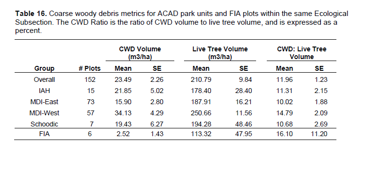

      
```{r setup, include=FALSE}
knitr::opts_chunk$set(echo = FALSE)
# load in packages
library(magrittr)
library(devtools)
library(tidyverse)
library(NCRNbirds)
library(leaflet)
library(cowplot)
library(readxl)
library(lubridate)
library(plotly)
library(knitr)
library(kableExtra)
library(formattable)
library(RColorBrewer)
library(sf)

# Load data
at_centerline <- readRDS("summary_data/at_centerline.rds")
n_plots_per_ecosubsection <- readRDS("summary_data/n_plots_per_ecosubsection.rds")
div <- readRDS("summary_data/div.rds")
div_year <- readRDS("summary_data/div_year.rds")
bio_top10 <- readRDS("summary_data/bio_top10.rds")
bio_year_top10 <- readRDS("summary_data/bio_year_top10.rds")
tpa_top10 <- readRDS("summary_data/tpa_top10.rds")
tpa_year_top10 <- readRDS("summary_data/tpa_year_top10.rds")
```

`r params$region` Region{.tabset .tabset-fade .tabset-pills}
------------------------------------
## {.tabset}
### Overview
<div style="float:right;position:relative;top:10px;padding:5px 5px 5px 10px;margin:0px 5px 10px 5px">
```{r, echo = FALSE,  fig.height=5.75, fig.width= 5.75, fig.align = 'left', warning= FALSE, comment=FALSE, message=FALSE,}
# Map of AT with HUC10 Shell and AT center line zoomed into selected subregion (NE) showing number of FIA plots per ecoregion as chloropleth. 
pal <- colorBin("Oranges", domain = n_plots_per_ecosubsection[["n_plots"]], bins = 9)

n_plots_per_ecosubsection %>%
  leaflet() %>%
  addTiles() %>%
  addPolygons(fillColor = ~ pal(n_plots_per_ecosubsection[["n_plots"]]),
              fillOpacity = 1,
              opacity = 0,
              popup = paste0("<b>Ecosubsection: </b>",
                             n_plots_per_ecosubsection[["SUBSECTION"]],
                             "<br> <b>Number of FIA Plots: </b>",
                             n_plots_per_ecosubsection[["n_plots"]])) %>%
  addPolylines(data = at_centerline,
               color = "black",
               opacity = 1,
               weight = 2) %>%
  addLegend(pal = pal,
            values = ~n_plots_per_ecosubsection[["n_plots"]],
            title = "Number of FIA Plots",
            position = "bottomright") 
```
<p class='capwrap'>
Map of AT with HUC10 Shell and AT center line zoomed into selected subregion (NE) showing number of FIA plots per ecoregion as chloropleth.  </p>
</div>

<h3> Text Block Title </h3>

<p> Text Block
Could use text from Stanke’s website: Forests of the Appalachian National Scenic Trail | rFIA
(Once the basic template is built I can add in the text summarizing the data for the managers.) </p>

<h3>another generic header</h3>

<p> More text. </p>

### Species Diversity {.tabset }

<p>  Text block describing metrics for most recent Species Diversity. Shannon’s Diversity Index (alpha) Shannon’s Evenness Index (alpha) Species Richness (alpha) e.g., Species diversity | rFIA I would also use this area to describe basic patterns </p> 

#### Shannon’s Diversity Index (alpha)

<div style="float:right;position:relative;top:10px;padding:5px 5px 5px 10px;margin:0px 5px 10px 5px">
```{r, echo = FALSE,  fig.height=5.75, fig.width= 5.75, fig.align = 'left', warning= FALSE, comment=FALSE, message=FALSE}
pal <- colorBin("Purples", domain = div[["H_a"]], bins = 9)

div %>%
  leaflet() %>%
  addTiles() %>%
  addPolygons(fillColor = ~ pal(div[["H_a"]]),
              fillOpacity = 1,
              opacity = 0,
              popup = paste0("<b>Ecosubsection: </b>",
                             div[["SUBSECTION"]],
                             "<br> <b>mean Shannon's Diversity Index,<br> alpha (stand) level: </b>",
                             round(div[["H_a"]], 3))) %>%
  addPolylines(data = at_centerline,
               color = "black",
               opacity = 1,
               weight = 2) %>%
  addLegend(pal = pal,
            values = ~div[["H_a"]],
            title = "mean Shannon's Diversity Index,<br> alpha (stand) level",
            position = "bottomright") 
```
<p class='capwrap'>
Shannon's Diversity Index Plot  </p>
</div>

<div style="float:right;position:relative;top:10px;padding:5px 5px 5px 10px;margin:0px 5px 10px 5px">
```{r, echo = FALSE,  fig.height=5.75, fig.width= 5.75, fig.align = 'left', warning= FALSE, comment=FALSE, message=FALSE}
div_year %>%
  ggplot(aes(x = MEASYEAR, y = H_a)) +
  geom_point() + 
  geom_line() +
  facet_wrap(~SUBSECTION)
```
<p class='capwrap'>
Time series Plot  </p>
</div>

This text might describe the plots that relate to Shannon's Diversity Index, and might also explain the index a bit more in depth. 

#### Shannon’s Evenness Index (alpha)

<div style="float:right;position:relative;top:10px;padding:5px 5px 5px 10px;margin:0px 5px 10px 5px">
```{r, echo = FALSE,  fig.height=5.75, fig.width= 5.75, fig.align = 'left', warning= FALSE, comment=FALSE, message=FALSE}
pal <- colorBin("Purples", domain = div[["Eh_a"]], bins = 9)

div %>%
  leaflet() %>%
  addTiles() %>%
  addPolygons(fillColor = ~ pal(div[["Eh_a"]]),
              fillOpacity = 1,
              opacity = 0,
              popup = paste0("<b>Ecosubsection: </b>",
                             div[["SUBSECTION"]],
                             "<br> <b>mean Shannon's Equitability Index,<br> alpha (stand) level: </b>",
                             round(div[["Eh_a"]], 3))) %>%
  addPolylines(data = at_centerline,
               color = "black",
               opacity = 1,
               weight = 2) %>%
  addLegend(pal = pal,
            values = ~div[["Eh_a"]],
            title = "mean Shannon's Equitability Index,<br> alpha (stand) level",
            position = "bottomright") 
```
<p class='capwrap'>
Shannon's Eveness Index Plot  </p>
</div>

<div style="float:right;position:relative;top:10px;padding:5px 5px 5px 10px;margin:0px 5px 10px 5px">
```{r, echo = FALSE,  fig.height=5.75, fig.width= 5.75, fig.align = 'left', warning= FALSE, comment=FALSE, message=FALSE}
div_year %>%
  ggplot(aes(x = MEASYEAR, y = Eh_a)) +
  geom_point() + 
  geom_line() +
  facet_wrap(~SUBSECTION)
```
<p class='capwrap'>
Time series Plot  </p>
</div>

This text might describe the plots that relate to Shannon's Eveness Index, and might also explain the index a bit more in depth. 


#### Species Richness (alpha)

<div style="float:right;position:relative;top:10px;padding:5px 5px 5px 10px;margin:0px 5px 10px 5px">
```{r, echo = FALSE,  fig.height=5.75, fig.width= 5.75, fig.align = 'left', warning= FALSE, comment=FALSE, message=FALSE}
pal <- colorBin("Purples", domain = div[["S_a"]], bins = 9)

div %>%
  leaflet() %>%
  addTiles() %>%
  addPolygons(fillColor = ~ pal(div[["S_a"]]),
              fillOpacity = 1,
              opacity = 0,
              popup = paste0("<b>Ecosubsection: </b>",
                             div[["SUBSECTION"]],
                             "<br> <b>mean Species Richness,<br> alpha (stand) level: </b>",
                             round(div[["S_a"]], 3))) %>%
  addPolylines(data = at_centerline,
               color = "black",
               opacity = 1,
               weight = 2) %>%
  addLegend(pal = pal,
            values = ~div[["S_a"]],
            title = "mean Species Richness,<br> alpha (stand) level",
            position = "bottomright") 
```
<p class='capwrap'>
Species Richness Plot  </p>
</div>

<div style="float:right;position:relative;top:10px;padding:5px 5px 5px 10px;margin:0px 5px 10px 5px">
```{r, echo = FALSE,  fig.height=5.75, fig.width= 5.75, fig.align = 'left', warning= FALSE, comment=FALSE, message=FALSE}
div_year %>%
  ggplot(aes(x = MEASYEAR, y = S_a)) +
  geom_point() + 
  geom_line() +
  facet_wrap(~SUBSECTION)
```
<p class='capwrap'>
Time series Plot  </p>
</div>

This text might describe the plots that relate to Species Richness, and might also explain the species richness a bit more in depth. 

### Tree Density, Biomass, and Carbon {.tabset }

```{r setup_cb, include = F}
nb.cols <- 10
mycolors <- colorRampPalette(brewer.pal(8, "Accent"))(nb.cols)
```


Text area describing metrics and patterns for density and biomass. 

#### Tree Density {.tabset }

##### Means

<div style="float:right;position:relative;top:10px;padding:1px 1px 1px 1px;margin:0px 5px 10px 5px">
```{r, echo=FALSE, fig.height=4, fig.width= 4, fig.align = 'left', message=FALSE}
tpa_top10 %>%
  ggplot(aes(x = newClass,
             y = TPA,
             fill = SCIENTIFIC_NAME)) +
  geom_col() +
  theme_bw() +
  scale_fill_manual(values = mycolors) +
  theme(
    legend.position = c(.999, .999),
    legend.justification = c("right", "top"),
    legend.box.just = "right",
    legend.margin = margin(6, 6, 6, 6),
    legend.key.height = unit(0.25, 'cm')
    )
# Bar chart of mean species density and biomass per species by DBH class size for top 10 most abundant species
```
</div>

<div style="float:left;position:relative;top:10px;padding:1px 1px 1px 1px;margin:0px 5px 10px 5px">
```{r, echo=FALSE, fig.height=4, fig.width= 4, fig.align = 'right', message=FALSE}
tpa_year_top10 %>%
  ggplot(aes(x = MEASYEAR, y = TPA)) +
  geom_point() +
  geom_line() +
  facet_wrap(~SCIENTIFIC_NAME) +
  theme_bw()
# Time series plot showing top 5 species and Fraxinus density/biomass over time per ecoregion. It would be great to show all top 10 species but this could get a bit busy with 10 species X ecoregions). It may not be needed to show ecroregions.

# It would be great to repeat the above plots for total biomass and carbon
```
</div>

##### Totals

<div style="float:right;position:relative;top:10px;padding:1px 1px 1px 1px;margin:0px 5px 10px 5px">
```{r, echo=FALSE, fig.height=4, fig.width= 4, fig.align = 'left', message=FALSE}
tpa_top10 %>%
  ggplot(aes(x = newClass,
             y = TREE_TOTAL,
             fill = SCIENTIFIC_NAME)) +
  geom_col() +
  theme_bw() +
  scale_fill_manual(values = mycolors) +
  theme(
    legend.position = c(.999, .999),
    legend.justification = c("right", "top"),
    legend.box.just = "right",
    legend.margin = margin(6, 6, 6, 6),
    legend.key.height = unit(0.25, 'cm')
    )
# Bar chart of mean species density and biomass per species by DBH class size for top 10 most abundant species
```
</div>

<div style="float:left;position:relative;top:10px;padding:1px 1px 1px 1px;margin:0px 5px 10px 5px">
```{r, echo=FALSE, fig.height=4, fig.width= 4, fig.align = 'right', message=FALSE}
tpa_year_top10 %>%
  ggplot(aes(x = MEASYEAR, y = TREE_TOTAL)) +
  geom_point() +
  geom_line() +
  facet_wrap(~SCIENTIFIC_NAME) +
  theme_bw()
# Time series plot showing top 5 species and Fraxinus density/biomass over time per ecoregion. It would be great to show all top 10 species but this could get a bit busy with 10 species X ecoregions). It may not be needed to show ecroregions.

# It would be great to repeat the above plots for total biomass and carbon
```
</div>

#### Biomass {.tabset }

##### Means

<div style="float:right;position:relative;top:10px;padding:1px 1px 1px 1px;margin:0px 5px 10px 5px">
```{r, echo=FALSE, fig.height=4, fig.width= 4, fig.align = 'left', message=FALSE}
bio_top10 %>%
  ggplot(aes(x = newClass,
             y = BIO_ACRE,
             fill = SCIENTIFIC_NAME)) +
  geom_col() +
  theme_bw() +
  scale_fill_manual(values = mycolors) +
  theme(
    legend.position = c(.999, .999),
    legend.justification = c("right", "top"),
    legend.box.just = "right",
    legend.margin = margin(6, 6, 6, 6),
    legend.key.height = unit(0.25, 'cm')
    )
# Bar chart of mean species density and biomass per species by DBH class size for top 10 most abundant species
```
</div>

<div style="float:left;position:relative;top:10px;padding:1px 1px 1px 1px;margin:0px 5px 10px 5px">
```{r, echo=FALSE, fig.height=4, fig.width= 4, fig.align = 'right', message=FALSE}
bio_year_top10 %>%
  ggplot(aes(x = MEASYEAR, y = BIO_ACRE)) +
  geom_point() +
  geom_line() +
  facet_wrap(~SCIENTIFIC_NAME) +
  theme_bw()
# Time series plot showing top 5 species and Fraxinus density/biomass over time per ecoregion. It would be great to show all top 10 species but this could get a bit busy with 10 species X ecoregions). It may not be needed to show ecroregions.

# It would be great to repeat the above plots for total biomass and carbon
```
</div>

##### Totals

<div style="float:right;position:relative;top:10px;padding:1px 1px 1px 1px;margin:0px 5px 10px 5px">
```{r, echo=FALSE, fig.height=4, fig.width= 4, fig.align = 'left', message=FALSE}
bio_top10 %>%
  ggplot(aes(x = newClass,
             y = BIO_TOTAL,
             fill = SCIENTIFIC_NAME)) +
  geom_col() +
  theme_bw() +
  scale_fill_manual(values = mycolors) +
  theme(
    legend.position = c(.999, .999),
    legend.justification = c("right", "top"),
    legend.box.just = "right",
    legend.margin = margin(6, 6, 6, 6),
    legend.key.height = unit(0.25, 'cm')
    )
# Bar chart of mean species density and biomass per species by DBH class size for top 10 most abundant species
```
</div>

<div style="float:left;position:relative;top:10px;padding:1px 1px 1px 1px;margin:0px 5px 10px 5px">
```{r, echo=FALSE, fig.height=4, fig.width= 4, fig.align = 'right', message=FALSE}
bio_year_top10 %>%
  ggplot(aes(x = MEASYEAR, y = BIO_TOTAL)) +
  geom_point() +
  geom_line() +
  facet_wrap(~SCIENTIFIC_NAME) +
  theme_bw()
# Time series plot showing top 5 species and Fraxinus density/biomass over time per ecoregion. It would be great to show all top 10 species but this could get a bit busy with 10 species X ecoregions). It may not be needed to show ecroregions.

# It would be great to repeat the above plots for total biomass and carbon
```
</div>


#### Carbon {.tabset }

##### Means

<div style="float:right;position:relative;top:10px;padding:1px 1px 1px 1px;margin:0px 5px 10px 5px">
```{r, echo=FALSE, fig.height=4, fig.width= 4, fig.align = 'left', message=FALSE}
bio_top10 %>%
  ggplot(aes(x = newClass,
             y = CARB_ACRE,
             fill = SCIENTIFIC_NAME)) +
  geom_col() +
  theme_bw() +
  scale_fill_manual(values = mycolors) +
  theme(
    legend.position = c(.999, .999),
    legend.justification = c("right", "top"),
    legend.box.just = "right",
    legend.margin = margin(6, 6, 6, 6),
    legend.key.height = unit(0.25, 'cm')
    )
# Bar chart of mean species density and biomass per species by DBH class size for top 10 most abundant species
```
</div>

<div style="float:left;position:relative;top:10px;padding:1px 1px 1px 1px;margin:0px 5px 10px 5px">
```{r, echo=FALSE, fig.height=4, fig.width= 4, fig.align = 'right', message=FALSE}
bio_year_top10 %>%
  ggplot(aes(x = MEASYEAR, y = CARB_ACRE)) +
  geom_point() +
  geom_line() +
  facet_wrap(~SCIENTIFIC_NAME) +
  theme_bw()
# Time series plot showing top 5 species and Fraxinus density/biomass over time per ecoregion. It would be great to show all top 10 species but this could get a bit busy with 10 species X ecoregions). It may not be needed to show ecroregions.

# It would be great to repeat the above plots for total biomass and carbon
```
</div>

##### Totals

<div style="float:right;position:relative;top:10px;padding:1px 1px 1px 1px;margin:0px 5px 10px 5px">
```{r, echo=FALSE, fig.height=4, fig.width= 4, fig.align = 'left', message=FALSE}
bio_top10 %>%
  ggplot(aes(x = newClass,
             y = CARB_TOTAL,
             fill = SCIENTIFIC_NAME)) +
  geom_col() +
  theme_bw() +
  scale_fill_manual(values = mycolors) +
  theme(
    legend.position = c(.999, .999),
    legend.justification = c("right", "top"),
    legend.box.just = "right",
    legend.margin = margin(6, 6, 6, 6),
    legend.key.height = unit(0.25, 'cm')
    )
# Bar chart of mean species density and biomass per species by DBH class size for top 10 most abundant species
```
</div>

<div style="float:left;position:relative;top:10px;padding:1px 1px 1px 1px;margin:0px 5px 10px 5px">
```{r, echo=FALSE, fig.height=4, fig.width= 4, fig.align = 'right', message=FALSE}
bio_year_top10 %>%
  ggplot(aes(x = MEASYEAR, y = CARB_TOTAL)) +
  geom_point() +
  geom_line() +
  facet_wrap(~SCIENTIFIC_NAME) +
  theme_bw()
# Time series plot showing top 5 species and Fraxinus density/biomass over time per ecoregion. It would be great to show all top 10 species but this could get a bit busy with 10 species X ecoregions). It may not be needed to show ecroregions.

# It would be great to repeat the above plots for total biomass and carbon
```
</div>


### Tree Vital Rates {.tabset}

Text area describing metrics and patterns of tree growth and mortality ( tree basal area, biomass  growth, stand level basal area and biomass growth. Annual mortality and recruitment)

```{r}
# Bar chart showing mean annual growth per top 10 species across region of interest (NE in this example)

# Similar map and bar charts for basal area and biomass growth

# Tabular summary of mean annual mortality rates of top 10 species per ecoregion in area of interest (NE in this example)

# choropleth map for diameter growth rate (in/yr)
```

### Regeneration

Text area describing regeneration.

This tab would show only density and I can’t recall whether FIA denotes regen by size classes. For regen we commonly use 15-30 cm, 30-100cm, 100-150cm, > 150 and <1cm DBH, and 1-10 cm DBH

<div style="float:right;position:relative;top:10px;padding:1px 1px 1px 1px;margin:0px 5px 10px 5px">
```{r, echo=FALSE, fig.height=4, fig.width= 4, fig.align = 'left', message=FALSE}
ggplot()
# Bar chart of mean species density per species by DBH class size for top 10 most abundant species
```
</div>

<div style="float:left;position:relative;top:10px;padding:1px 1px 1px 1px;margin:0px 5px 10px 5px">
```{r, echo=FALSE, fig.height=4, fig.width= 4, fig.align = 'right', message=FALSE}
ggplot()
# Time series plot showing sapling density (1-10 DBH) over time per species and ecoregion. 

# We also commonly report regen as a stocking index based on McWilliams (~2005). It estimates density by weighting the above size classes.
```
</div>

### Snags

Text area describing snags per acre and by size class.

<div style="float:right;position:relative;top:10px;padding:1px 1px 1px 1px;margin:0px 5px 10px 5px">
```{r, echo=FALSE, fig.height=4, fig.width= 4, fig.align = 'left', message=FALSE}
ggplot()
# BBar chart of mean snag density per diameter size class for hard vs softwood (if possible)
```
</div>

<div style="float:left;position:relative;top:10px;padding:1px 1px 1px 1px;margin:0px 5px 10px 5px">
```{r, echo=FALSE, fig.height=4, fig.width= 4, fig.align = 'right', message=FALSE}
ggplot()
# Chloropleth map showing % snag abundance of total TPA; see Snag abundance | rFIA
```
</div>

### Downed Woody Debris

Text area describing DWD: volume and CWD:live tree volume

A table like this one?

```{r, fig.align='center'}

```


### Invasive Plants

Text area describing invasive abundance of top species (shrubs and trees).

Combination of chloropleth maps and time series of key species per region. It may only be possible to generate a tabular summary of presence per ecoregion depending on the state, panel and species of interest. This section could also just be a list of species detected with frequency.

### References
