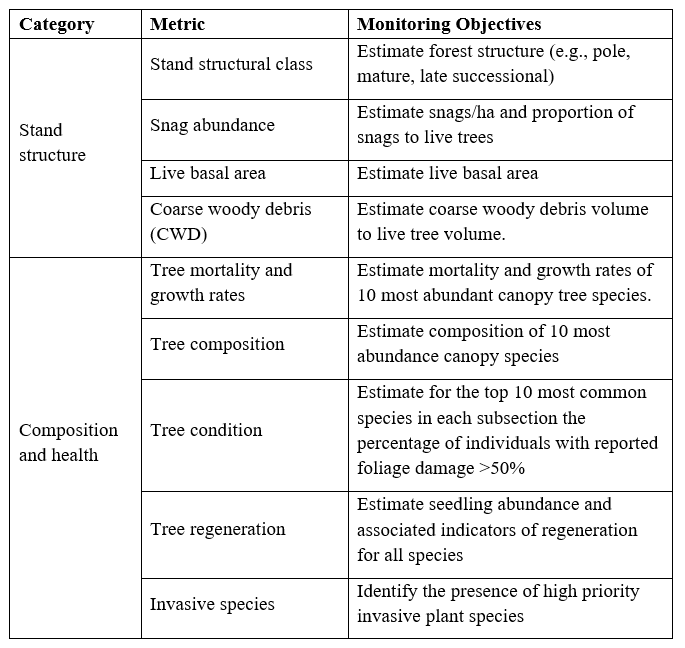

      
```{r setup, include=FALSE}
knitr::opts_chunk$set(echo = FALSE)
# load in packages
library(magrittr)
library(devtools)
library(tidyverse)
library(NCRNbirds)
library(leaflet)
library(cowplot)
library(readxl)
library(lubridate)
library(plotly)
library(knitr)
library(kableExtra)
library(formattable)
library(RColorBrewer)
library(sf)

# Load data
at_centerline <- readRDS("summary_data/at_centerline.rds")
n_plots_per_ecosubsection <- readRDS("summary_data/n_plots_per_ecosubsection.rds")
div <- readRDS("summary_data/div.rds")
div_year <- readRDS("summary_data/div_year.rds")
bio_top10 <- readRDS("summary_data/bio_top10.rds")
bio_year_top10 <- readRDS("summary_data/bio_year_top10.rds")
tpa_top10 <- readRDS("summary_data/tpa_top10.rds")
tpa_year_top10 <- readRDS("summary_data/tpa_year_top10.rds")
mort <- readRDS("summary_data/mort.rds")
mort_year <- readRDS("summary_data/mort_year.rds")
mort_year_top10 <- readRDS("summary_data/mort_year_top10.rds")
downwoody <- readRDS("summary_data/downwoody.rds")
invasive <- readRDS("summary_data/invasive.rds")
snag <- readRDS("summary_data/snag.rds")
snagV <- readRDS("summary_data/snagV.rds")

```

`r params$region` Region{.tabset .tabset-fade .tabset-pills}
------------------------------------
### Overview {.tabset}
#### Background
<div style="float:right;position:relative;top:10px;padding:5px 5px 5px 10px;margin:0px 5px 10px 5px">
```{r, echo = FALSE,  fig.height=5.75, fig.width= 5.75, fig.align = 'left', warning= FALSE, comment=FALSE, message=FALSE,}
# Map of AT with HUC10 Shell and AT center line zoomed into selected subregion (NE) showing number of FIA plots per ecoregion as chloropleth. 

pal <- colorBin("Oranges", domain = n_plots_per_ecosubsection[["n_plots"]], bins = 5, na.color = NA )

n_plots_per_ecosubsection %>%
  leaflet() %>%
  #setView(lng = -71.0589, lat = 42.3601, zoom = 12) %>%  
  addTiles() %>%
  addPolygons(fillColor = ~ pal(n_plots_per_ecosubsection[["n_plots"]]),
              fillOpacity = 1,
              opacity = 0,
              stroke= TRUE, weight = 1,
              popup = paste0("<b>Ecological Section: </b>",
                             n_plots_per_ecosubsection[["SECTION_NA"]],
                             "<br> <b>SubSection: </b>",
                             n_plots_per_ecosubsection[["SUBSECTI_1"]],
                             "<br> <b>Number of FIA Plots: </b>",
                             n_plots_per_ecosubsection[["n_plots"]])) %>%
  addPolylines(data = at_centerline,
               color = "black",
               opacity = 1,
               weight = 2) %>%
  addLegend(pal = pal,
            values = ~n_plots_per_ecosubsection[["n_plots"]],
            title = "Number of FIA Plots",
            position = "bottomright", bins= 5, na.label = "") 
```
<p class='capwrap'>
Map of Appalachian Trail HUC10 Shell and AT center line showing number of FIA plots per Ecoregional SubSections following Cleland et al. (2007). Clicking on the subsection will display the number of FIA plots used to summarize forest health condition.  </p>
</div>

<h3> Vital Signs Monitoring along the Appalachian Scenic</h3>

<p> The Appalachian National Scenic Trail (APPA) traverses more than 2,170 miles across the highest ridgelines of the Appalachian Mountains, from Georgia to Maine. Along the way it crosses through 14 states, eight National Forests, six National Parks, six Inventory and Monitoring networks, a National Wildlife Refuge, three Tennessee Valley Authority properties, one Smithsonian Institute property, and over 280 local jurisdictions. The Trail is managed in partnership with the Appalachian Trail Conservancy (ATC) and its 30 affiliated Trail-maintaining clubs under an extraordinary cooperative management system.

The Appalachian Trail is uniquely situated to serve as a barometer for the air, water, and biological diversity of the Appalachian Mountains and much of the eastern United States. The trail’s length, north-south alignment, changes in elevation, and numerous peaks and ridges it crosses  creates one of the most biodiverse units of the National Park System. The Appalachian Trail is monitored through the North East Temperate Inventory and Monitoring Network’s (NETN) Vital Sign Monitoring Program (Dieffenbach 2011). The goals of the monitoring program are:

<ul>
<li> to summarize the status and trends of park ecosystem vital signs to allow managers to make better-informed decisions, and
<li> to provide early warning of abnormal conditions of monitored resources to help develop effective mitigation measures.
</ul>

#### Forest Health Monitoring Objectives

<p>The region through which APPA passes is predominantly forested and key stressors of these resources include land use change and habitat fragmentation on lands adjacent to the Appalachian NST corridor, nonnative species, visitor usage, wet and dry deposition, and climate change. The large, but narrow configuration of the APPA makes a ground-based plot monitoring program logistically and financially infeasible for the National Park Service to implement. In light of that challenge, NETN developed a data acquisition protocol (Dieffenbach 2018) to track the overall condition of forest resources along the Appalachian Trail using plot-based data collected by the Forest Inventory and Analysis (FIA) Program.</p>

<div style="float:right;position:relative;top:10px;padding:5px 5px 5px 10px;margin:0px 5px 10px 5px">
```{r objs, fig.align='left',fig.height=5.75, fig.width= 5.75}

```
<p class='capwrap'>
Appalachian National Scenic Trail Forest Monitoring Protocol objectives . All objectives will evaluate variation in metrics across plots and ecoregional subsections of the Appalachian NST within the HUC10 Shell.</p>
</div>

#### Methods

<p>In cooperation with Michigan State University, NETN leverages the USFS's Forest Inventory and Analysis database to assess the status and trends in forest condition along the Appalachian Trail and neighboring lands (Stanke et al. 2020). Specifically, FIA data is compiled across 14 states for every available year of data and then data are extracted from plot locations falling within  APPA's HUC10 Shell.Forest inventory data is then summarized following the methods of Stanke et al. (2020) into distinct ecological subsections along  the Trail (Cleland et al. 2007; Dieffenbach 2018). The R package <b> rFIA </b> is used to compile the data and calculate the following metrics at each ecoregional subsection: </p>
<ul>
<li> <b>Stand structural stage:</b> Percentage of Area in Pole, Mature, and Late Stage forest
<li> <b>Forest Demographics:</b> Annual Recruitment, Mortality, and Harvest
<li> <b>Tree abundance and Biomass: </b> Trees per Acre (TPA), Basal Area (BAA), Biomass, and Carbon
<li> <b>Tree diversity:</b> Richness, Shannon’s diversity, and Evenness 
<li> <b>Tree vital rates:</b> Annual Diameter, Basal Area, and Biomass growth
<li> <b>Regeneration:</b> Regeneration Density (<5” DBH)
<li> <b>Snags:</b> Dead Tree TPA, BAA, Biomass, Carbon, and Relative Fraction
<li> <b>Down Woody Debris:</b> Volume, Biomass, and Carbon
<li> <b>Invasive Plants (where possible):</b> Percent Cover
</ul>

For more specific details about the methods used to calculate the forest metrics above please consult Stanke et al. (2020) or NETN's protocol (Dieffenbach 2018).


<div style="float:right;position:relative;top:10px;padding:5px 5px 5px 10px;margin:0px 5px 10px 5px">
```{r methods, fig.align='left'}
knitr::include_graphics("rFIA logo.png")
```
</div>

### Structural Stage Distribution {.tabset }

We used rFIA to estimate forest structural stage distributions, with associated sampling errors, within ecoregion subsections which surround the Appalachian National Scenic Trail. We produced estimates for each FIA reporting year which was common among all states included in the analysis (2005-2016, with the exception of 2008).

Insert map like https://rfia.netlify.app/at/ss/ showing data from last inventory.


### Species Diversity {.tabset }

<p>  We used rFIA to estimate average species diversity indices for live trees (DBH >= 12.7cm) at alpha, beta, and gamma levels, with associated sampling errors, within ecoregion subsections which surround the Appalachian National Scenic Trail. We produced estimates for each FIA reporting year which was common among all states included in the analysis (2005-2016, with the exception of 2008). </p> 

#### Species Richness

<div style="float:right;position:relative;top:10px;padding:5px 5px 5px 10px;margin:0px 5px 10px 5px">
```{r, echo = FALSE,  fig.height=5.75, fig.width= 5.75, fig.align = 'left', warning= FALSE, comment=FALSE, message=FALSE}
pal <- colorBin("Purples", domain = div[["S_a"]], bins = 5)

div %>%
  leaflet() %>%
  addTiles() %>%
  addPolygons(fillColor = ~ pal(div[["S_a"]]),
              fillOpacity = 1,
              opacity = 0,
              popup = paste0("<b>Ecological Section: </b>",
                             div[["SECTION_NA"]],
                             "<br> <b>SubSection: </b>",
                             div[["SUBSECTI_1"]],
                             "<br> <b>Avg. Species Richness,<br> (stand) level: </b>",
                             round(div[["S_a"]], 1))) %>%
  addPolylines(data = at_centerline,
               color = "black",
               opacity = 1,
               weight = 2) %>%
  addLegend(pal = pal,
            values = ~div[["S_a"]],
            title = "Avg. Species Richness,<br> (stand) level",
            position = "bottomright", bins= 5, na.label = "") 
```
<p class='capwrap'>
Species Richness Plot  </p>
</div>

<div style="float:right;position:relative;top:10px;padding:5px 5px 5px 10px;margin:0px 5px 10px 5px">
```{r, echo = FALSE,  fig.height=14, fig.width= 10, fig.align = 'left', warning= FALSE, comment=FALSE, message=FALSE}
div_year %>%
  group_by(SUBSECTI_1) %>% 
  ggplot(aes(x = MEASYEAR, y = S_a, color = SUBSECTI_1 )) +
  geom_point()+geom_line()+
  theme_bw()+
  facet_wrap(~SECTION_NA, nrow= 6, scales = "free_y")+
  scale_color_viridis_d()+
  theme(legend.position = "bottom")+
  labs(y=" Species Richness" ,x= "Year", color = "")
```
<p class='capwrap'>
Time series Plot  </p>
</div>

This text might describe the plots that relate to Species Richness, and might also explain the species richness a bit more in depth. 

#### Shannon’s Diversity Index

<div style="float:right;position:relative;top:10px;padding:5px 5px 5px 10px;margin:0px 5px 10px 5px">
```{r, echo = FALSE,  fig.height=5.75, fig.width= 5.75, fig.align = 'left', warning= FALSE, comment=FALSE, message=FALSE}
pal <- colorBin("Purples", domain = div[["H_a"]], bins = 5)

div %>%
  leaflet() %>%
  addTiles() %>%
  addPolygons(fillColor = ~ pal(div[["H_a"]]),
              fillOpacity = 1,
              opacity = 0,
              popup = paste0("<b>Ecological Section: </b>",
                             div[["SECTION_NA"]],
                             "<br> <b>SubSection: </b>",
                             div[["SUBSECTI_1"]],
                             "<br> <b>mean Shannon's Diversity Index,<br> alpha (stand) level: </b>",
                             round(div[["H_a"]], 1))) %>%
  addPolylines(data = at_centerline,
               color = "black",
               opacity = 1,
               weight = 2) %>%
  addLegend(pal = pal,
            values = ~div[["H_a"]],
            title = "mean Shannon's Diversity Index,<br> alpha (stand) level",
            position = "bottomright",bins= 5, na.label = "") 
```
<p class='capwrap'>
Shannon's Diversity Index Plot  </p>
</div>

<div style="float:right;position:relative;top:10px;padding:5px 5px 5px 10px;margin:0px 5px 10px 5px">
```{r, echo = FALSE,  fig.height=5.75, fig.width= 5.75, fig.align = 'left', warning= FALSE, comment=FALSE, message=FALSE}
div_year %>%
  ggplot(aes(x = MEASYEAR, y = H_a)) +
  geom_point() + 
  geom_line() +
  facet_wrap(~SUBSECTION)
```
<p class='capwrap'>
Time series Plot  </p>
</div>

This text might describe the plots that relate to Shannon's Diversity Index, and might also explain the index a bit more in depth. 

#### Shannon’s Evenness Index

<div style="float:right;position:relative;top:10px;padding:5px 5px 5px 10px;margin:0px 5px 10px 5px">
```{r, echo = FALSE,  fig.height=5.75, fig.width= 5.75, fig.align = 'left', warning= FALSE, comment=FALSE, message=FALSE}
pal <- colorBin("Purples", domain = div[["Eh_a"]], bins = 5)

div %>%
  leaflet() %>%
  addTiles() %>%
  addPolygons(fillColor = ~ pal(div[["Eh_a"]]),
              fillOpacity = 1,
              opacity = 0,
              popup = paste0("<b>Ecological Section: </b>",
                             div[["SECTION_NA"]],
                             "<br> <b>SubSection: </b>",
                             div[["SUBSECTI_1"]],
                             "<br> <b>mean Shannon's Equitability Index,<br> alpha (stand) level: </b>",
                             round(div[["Eh_a"]], 3))) %>%
  addPolylines(data = at_centerline,
               color = "black",
               opacity = 1,
               weight = 2) %>%
  addLegend(pal = pal,
            values = ~div[["Eh_a"]],
            title = "mean Shannon's Equitability Index,<br> alpha (stand) level",
            position = "bottomright",bins= 5, na.label = "") 
```
<p class='capwrap'>
Shannon's Eveness Index Plot  </p>
</div>

<div style="float:right;position:relative;top:10px;padding:5px 5px 5px 10px;margin:0px 5px 10px 5px">
```{r, echo = FALSE,  fig.height=5.75, fig.width= 5.75, fig.align = 'left', warning= FALSE, comment=FALSE, message=FALSE}
div_year %>%
  ggplot(aes(x = MEASYEAR, y = Eh_a)) +
  geom_point() + 
  geom_line() +
  facet_wrap(~SUBSECTION)
```
<p class='capwrap'>
Time series Plot  </p>
</div>

This text might describe the plots that relate to Shannon's Eveness Index, and might also explain the index a bit more in depth. 

### Tree Density and Carbon {.tabset }

```{r setup_cb, include = F}
nb.cols <- 10
mycolors <- colorRampPalette(brewer.pal(8, "Accent"))(nb.cols)
```


We used rFIA to estimate average abundance and biomass of the top 10 most abundant live trees (DBH>=12.7cm), with associated sampling errors, within ecoregion subsections which surround the Appalachian National Scenic Trail. We produced estimates for each FIA reporting year which was common among all states included in the analysis (2005-2016, with the exception of 2008).

#### Stems per Acre

<div style="float:right;position:relative;top:10px;padding:5px 5px 5px 10px;margin:0px 5px 10px 5px">
```{r, echo = FALSE,  fig.height=5.75, fig.width= 5.75, fig.align = 'left', warning= FALSE, comment=FALSE, message=FALSE}
pal <- colorBin("Purples", domain = tpa_All[["TPA"]], bins = 5)

tpa_All %>% 
  leaflet() %>%
  addTiles() %>%
  addPolygons(fillColor = ~ pal(tpa_All[["TPA"]]),
              fillOpacity = 1,
              opacity = 0,
              popup = paste0("<b>Ecological Section: </b>",
                             tpa_All[["SECTION_NA"]],
                             "<br> <b>SubSection: </b>",
                             tpa_All[["SUBSECTI_1"]],
                             "<br> <b>Avg. Stems per Acre,<br>: </b>",
                             round(tpa_All[["TPA"]], 3))) %>%
  addPolylines(data = at_centerline,
               color = "black",
               opacity = 1,
               weight = 2) %>%
  addLegend(pal = pal,
            values = ~tpa_All[["TPA"]],
            title = "Avg. Stems per Acre,<br>",
            position = "bottomright",bins= 5, na.label = "") 
```
<p class='capwrap'>
Map of the Average Stems (DBH >= 5' DBH) per Acre in each Subsection  </p>
</div>


<div style="float:left;position:relative;top:10px;padding:1px 1px 1px 1px;margin:0px 5px 10px 5px">
```{r, echo=FALSE, fig.height=8, fig.width= 12, fig.align = 'right', message=FALSE}
tpa_top10 %>% 
  mutate(COMMON_NAME = toupper(COMMON_NAME)) %>% 
  ggplot(aes(x = COMMON_NAME, y = TPA, fill= COMMON_NAME)) +
  geom_bar(stat ="identity") +
  #geom_line() +
  labs(x = "",
       y = "Stems per Acre") +
  facet_wrap(~SECTION_NA) +
   scale_fill_viridis_d()+
  theme_bw() +
  coord_flip()+
  theme(legend.position = "none")+
  theme(strip.text = element_text(size = 9),
        axis.text.x = element_text(angle = 0))
```
<p class='capwrap'>
Stems (DBH >= 5") per Acre of top 10 most abundant species per Subsection  </p>
</div>

#### Size Class Distribution

<div style="float:right;position:relative;top:10px;padding:1px 1px 1px 1px;margin:0px 5px 10px 5px">
```{r, echo=FALSE, fig.height=8, fig.width= 12, fig.align = 'left', message=FALSE}
tpa_top10 %>%
   mutate(COMMON_NAME = toupper(COMMON_NAME)) %>% 
  ggplot(aes(x = newClass,
             y = TPA,
             fill = COMMON_NAME)) +
  geom_col() +
  theme_bw() +
  scale_fill_manual(values=mycolors) +
  facet_wrap(~SECTION_NA, scales= "free_y")+
  labs(
    x = "Size Class",
    y = "Stems per Acre",
    fill = ""
  ) +
  theme(
    legend.position = "top",
    legend.box.just = "right",
    legend.margin = margin(6, 6, 6, 6),
    legend.key.height = unit(0.25, 'cm'),
    axis.text.x = element_text(angle = 90)
    )
# Bar chart of mean species density and biomass per species by DBH class size for top 10 most abundant species
```
<p class='capwrap'>
Average density of trees per size class (inches) </p>
</div>

#### Carbon

<div style="float:right;position:relative;top:10px;padding:1px 1px 1px 1px;margin:0px 5px 10px 5px">
```{r, echo=FALSE, fig.height=4, fig.width= 4, fig.align = 'left', message=FALSE}
bio_top10 %>%
  ggplot(aes(x = newClass,
             y = CARB_ACRE,
             fill = SCIENTIFIC_NAME)) +
  geom_col() +
  theme_bw() +
  scale_fill_manual(values = mycolors) +
  labs(x = "Size Class",
       y = "Carbon/acre",
       fill = "Scientific Name") +
  theme(
    legend.position = c(.999, .999),
    legend.justification = c("right", "top"),
    legend.box.just = "right",
    legend.margin = margin(6, 6, 6, 6),
    legend.key.height = unit(0.25, 'cm'),
    axis.text.x = element_text(angle = 90)
    )
# Bar chart of mean species density and biomass per species by DBH class size for top 10 most abundant species
```
<p class='capwrap'>
Average Carbon per acre per size class (inches) </p>
</div></div>

### Tree Vital Rates {.tabset}

Text area describing metrics and patterns of tree growth and mortality ( tree basal area, biomass  growth, stand level basal area and biomass growth. Annual mortality and recruitment)

```{r}
# Bar chart showing mean annual growth per top 10 species across region of interest (NE in this example)
mort_year_top10 %>%
  ggplot(aes(x = MEASYEAR, y = GROW_PERC)) +
  geom_col() +
  labs(x = "Measurement year",
       y = "Mean annual growth (%)") +
  facet_wrap(~SCIENTIFIC_NAME) +
  theme_bw()

# Similar map and bar charts for basal area and biomass growth

# Tabular summary of mean annual mortality rates of top 10 species per ecoregion in area of interest (NE in this example)
mort_year_top10 %>%
  group_by(SCIENTIFIC_NAME) %>%
  summarize(`Average Mortality (%)` = mean(MORT_PERC)) %>%
  rename(`Scientific Name` = SCIENTIFIC_NAME) %>%
  kable()


# choropleth map for diameter growth rate (in/yr)
pal <- colorBin("Purples", domain = mort[["GROW_PERC"]], bins = 8)

mort %>%
  leaflet() %>%
  addTiles() %>%
  addPolygons(fillColor = ~ pal(mort[["GROW_PERC"]]),
              fillOpacity = 1,
              opacity = 0,
              popup = paste0("<b>Ecosubsection: </b>",
                             mort[["SUBSECTION"]],
                             "<br> <b>mean annual growth on survivors (%): </b>",
                             round(mort[["GROW_PERC"]], 3))) %>%
  addPolylines(data = at_centerline,
               color = "black",
               opacity = 1,
               weight = 2) %>%
  addLegend(pal = pal,
            values = ~mort[["GROW_PERC"]],
            title = "mean annual growth on survivors (%)",
            position = "bottomright") 
  
```

### Regeneration

Text area describing regeneration.

This tab would show only density and I can’t recall whether FIA denotes regen by size classes. For regen we commonly use 15-30 cm, 30-100cm, 100-150cm, > 150 and <1cm DBH, and 1-10 cm DBH

<div style="float:right;position:relative;top:10px;padding:1px 1px 1px 1px;margin:0px 5px 10px 5px">
```{r, echo=FALSE, fig.height=4, fig.width= 4, fig.align = 'left', message=FALSE}
ggplot()
# Bar chart of mean species density per species by DBH class size for top 10 most abundant species
```
</div>

<div style="float:left;position:relative;top:10px;padding:1px 1px 1px 1px;margin:0px 5px 10px 5px">
```{r, echo=FALSE, fig.height=4, fig.width= 4, fig.align = 'right', message=FALSE}
ggplot()
# Time series plot showing sapling density (1-10 DBH) over time per species and ecoregion. 

# We also commonly report regen as a stocking index based on McWilliams (~2005). It estimates density by weighting the above size classes.
```
</div>

### Snags

Text area describing snags per acre and by size class.

<div style="float:right;position:relative;top:10px;padding:1px 1px 1px 1px;margin:0px 5px 10px 5px">
```{r, echo=FALSE, fig.height=4, fig.width= 4, fig.align = 'left', message=FALSE}
ggplot()
# BBar chart of mean snag density per diameter size class for hard vs softwood (if possible)
```
</div>

<div style="float:left;position:relative;top:10px;padding:1px 1px 1px 1px;margin:0px 5px 10px 5px">
```{r, echo=FALSE, fig.height=4, fig.width= 4, fig.align = 'right', message=FALSE}
ggplot()
# Chloropleth map showing % snag abundance of total TPA; see Snag abundance | rFIA
```
</div>

### Downed Woody Debris

Text area describing DWD: volume and CWD:live tree volume

A table like this one?

```{r, fig.align='center'}
knitr::include_graphics("dwd_table.png")

downwoody %>%
  group_by(SUBSECTION) %>%
  summarize(
    sum(nPlots_DWM),
    sum(nPlots_AREA),
    mean(VOL_ACRE),
    mean(BIO_ACRE),
    mean(CARB_ACRE)
  ) %>%
  kable()
```


### Invasive Plants

Text area describing invasive abundance of top species (shrubs and trees).

Combination of chloropleth maps and time series of key species per region. It may only be possible to generate a tabular summary of presence per ecoregion depending on the state, panel and species of interest. This section could also just be a list of species detected with frequency.

### References

Dieffenbach, F, 2011. Appalachian National Scenic Trail vital signs monitoring plan. Natural Resource Technical Report NPS/NETN/NRR—2011/389. National Park Service, Northeast Temperate Network, Woodstock, VT.

Dieffenbach, F. 2018. Appalachian National Scenic Trail forest health monitoring protocol. Natural Resource Report NPS/NETN/NRR—2018/1804. National Park Service, Fort Collins, Colorado.

Stanke, Hunter, Andrew O. Finley, A. S. Weed, Brian F. Walters, and Grant M. Domke. 2020. rFIA: An R package for estimation of forest       attributes with the US Forest Inventory and Analysis database. Environmental Modelling & Software 127: 104664.

